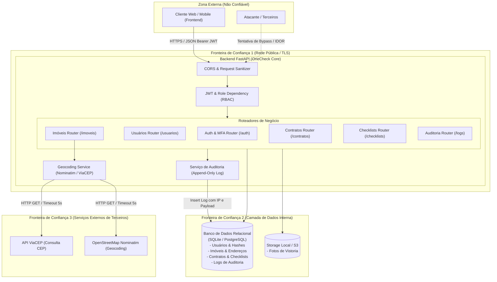

# Arquitetura do Sistema e Fronteiras de Confiança (v1)

## 1. Contexto e Domínio do Sistema

O **OneCheck** é uma plataforma de gestão de vistorias e locações imobiliárias projetada para imobiliárias, administradores, vistoriadores e locatários. A API RESTful centraliza o controle de acesso, cadastro de propriedades com geolocalização automática, emissão e assinatura de laudos periciais de vistoria de entrada e saída, além de auditoria rigorosa de todas as operações.

### Perfis de Acesso (RBAC)
- **Administrador (`admin`):** Acesso irrestrito a configurações, usuários, auditoria e operações do sistema. Exige MFA obrigatório.
- **Gestor (`gestor`):** Gestão operacional de imóveis, vistorias e contratos. Exige MFA obrigatório.
- **Vistoriador (`vistoriador`):** Realização e preenchimento técnico de checklists de vistoria e registro de avarias. Exige MFA obrigatório.
- **Locatário (`locatario`):** Visualização de contratos e imóveis vinculados, aceite ou contestação de laudos periciais de vistoria.

---

## 2. Diagrama de Arquitetura e Fronteiras de Confiança

---

## 3. Fronteiras de Confiança (Trust Boundaries)

| Fronteira | Descrição | Nível de Risco | Controles Implementados |
|---|---|---|---|
| **FC-01: Internet ➔ Backend** | Ponto de entrada de requisições públicas de navegadores, apps e atacantes. | **Alto** | - TLS/HTTPS compulsório. - Validação estrita de schema e tipos com Pydantic. - Autenticação JWT (HS256) com tempo de vida curto (15 min) e Refresh Token rotativo. - Fluxo de MFA (TOTP) obrigatório para roles administrativas com setup bloqueante no login. |
| **FC-02: Backend ➔ Banco de Dados / Storage** | Acesso às tabelas relacionais, credenciais protegidas e arquivos de mídia. | **Crítico** | - ORM SQLAlchemy com consultas parametrizadas (proteção total contra SQL Injection). - Senhas hasheadas via Bcrypt com salt aleatório. - Segredos MFA criptografados/armazenados com isolamento. - Soft delete com flag `ativo` em cascata impedindo perda acidental de dados. - Tabela de auditoria `log_operacoes` em modo append-only. |
| **FC-03: Backend ➔ APIs Externas (ViaCEP / Nominatim)** | Saída de requisições do backend para serviços de terceiros para enriquecimento de endereço. | **Médio** | - Requisições com timeout curto e explícito (5 segundos). - Tratamento de exceções com fallback gracioso (Fail-safe: não quebra a requisição caso a API externa esteja fora). - User-Agent customizado e sanitização rigorosa de parâmetros de busca. |

---

## 4. Controles Arquiteturais Chave

1. **Autenticação e Gestão de Sessões:**
   - Senhas protegidas com `bcrypt` (fator de custo padrão da biblioteca).
   - JWT emitido com `sub`, `role`, `type` e `exp`.
   - Refresh tokens opacos armazenados em banco como hash SHA-256 e revogados após rotação ou logout.
2. **Autorização Granular (RBAC + ABAC/Contextual):**
   - Dependência `require_roles("admin", ...)` para autorização por papel.
   - Validação contextual de propriedade (locatário só acessa imóveis, contratos e checklists vinculados a contratos ativos onde ele é o titular).
3. **Validação de Entrada e Imutabilidade de Estado:**
   - Schemas Pydantic tipados com restrições de tamanho, regex e enums válidos.
   - Máquina de estados para checklists e contratos (ex.: laudo finalizado ou imóvel locado com restrição de exclusão).
4. **Trilha de Auditoria e Não-Repúdio:**
   - Cada mutação de estado registra autor, entidade, ID da entidade, IP do cliente e payload JSON no banco de dados.
